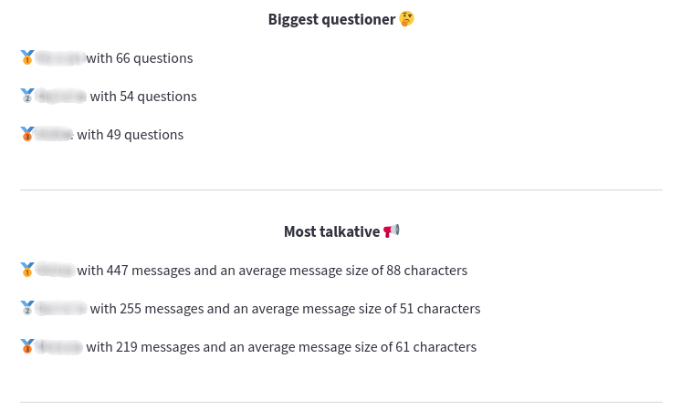
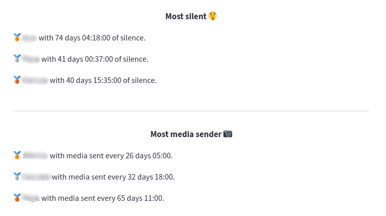
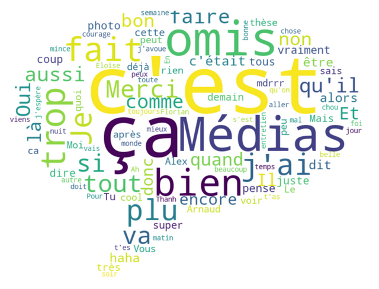
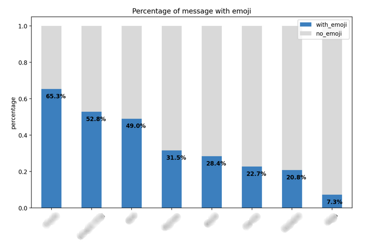
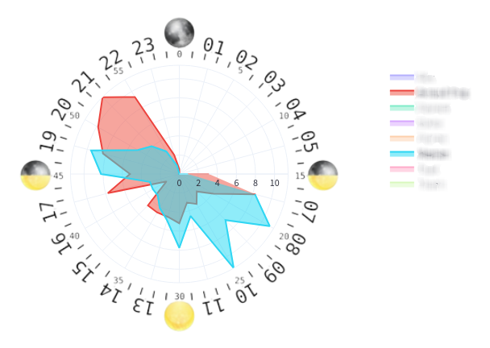
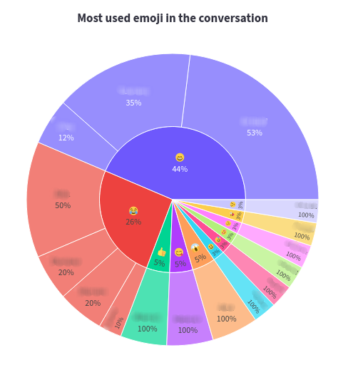

<br />
<h1>
<p align="center">
  
</p>
</h1>

<p align="center">
    Whatsapp Group Analyzer
    <br />
</p>

<p align="center">
  <a href="#examples-gallery">Gallery</a> •
  <a href="#warning-remarks">Remarks</a> •
  <a href="#rocket-technical-stack">Technical stack</a> 
</p>  


small porject description, what it can do ...


> **Analyze your WhatsApp group conversations on [this website](https://arnautt-whatsapp-group-analyzer-app-14gt3z.streamlitapp.com/).** 
> <br /> Follow the instructions on the sidebar and enjoy !


**Remark** : your data is of course not stored so feel free to use the application !


## Examples gallery

- Various information about the authors of the conversation showing,
for example, the podium of the most active or those who send the most media. 

<p align="center">
  
</p>

<p align="center">
  
</p>


- The most used words in the conversation by removing the stop words (i.e. common / useless words) : 
the size of the words is proportional to its frequency.

<p align="center">
  
</p>


- The percentage of messages with an emoji for each participant in the conversation.

<p align="center">
  
</p>


- Interactive comparison of the sending times of each message.

<p align="center">
  
</p>


- Distribution of the most used emojis with analysis of the biggest contributors.

<p align="center">
  
</p>


- And much more ! Use it with your own conversations to know them :)

## :warning: Remarks


1. The application allows you to analyze WhatsApp groups only.
So you have to choose a **conversation with at least 3 people**.

2. Depending on OS and language, WhatsApp conversation format can vary a lot.
There are currently two supported formats (one for French and one for English conversation) :


```
10/03/2022 à 19:49 - Name: Your message (French WhatsApp)
6/20/19, 19:49 - Name: Your message (English WhatsApp)
```


If you want the application to be compatible with your format, you can either format your conversation
to one of the two known formats at the moment or let me know which language / format you want to add.


3. The application uses Natural Language Processing and a wordcloud plot to analyze the words of your conversation.
If your conversation is not in French or English, please add your language
[here](https://github.com/Arnautt/whatsapp-group-analyzer/blob/master/app.py#L78-L85), 
following the same structure.


## :rocket: Technical stack 

- Data Processing : pandas
- Data Visualization : pyplot, seaborn, plotly
- Application Deployment : streamlit 
- Natural Language Processing : nltk 

